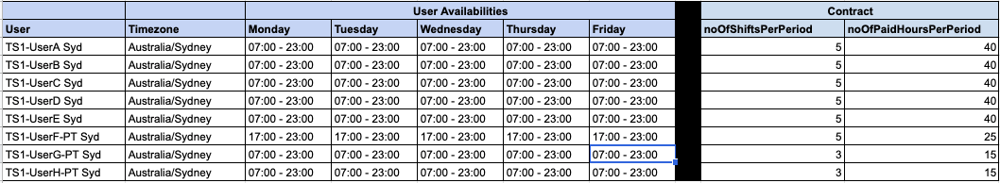

# Simple Template Rotations

In this scenario, shifts need to be generated based on the forecast requirements using below policy.

- Generate roster for 4 weeks period (March 23th - April 19th 2020)
- Fill users to contracted hours
- Rotate shifts fairly across rotation period
- Rotate user forward through **Shift Template** based on requirements
- Rotation Period is 1 week
- Fix shift start time within rotation period
- Use forecast requirement to determine start time
- No historical shifts are provided (for the sake of simplicity)

Based on the forecast requirements and users attached on this scenario, 
the system can produce a roster that has 100% coverage.

# One Week Coverage

## Monday, Tuesday, Wednesday & Friday Coverage

## Thursday Coverage

## April 06 - April 10 Coverage
Requirement for (April 06 - April 10) is slightly different from the rest of the week.
Since we have enough flexible part time users, the system should be able to generate shift for that week with 100% coverage.

# User Availabilities & Contract

# Shift Template

## "TS1 Block1 FT" shift template
Template configuration 

- start anytime between 07:00 - 08:00 (based on the timezone of the user)
- shift duration 8 hours
- applied to "Monday - Sunday"
- attached users 
    - ("TS1-UserA", "TS1-UserB", "TS1-UserC", "TS1-UserD" & "TS1-UserE")

## "TS1 Block2 FT" shift template
Template configuration

- start at 15:00 (based on the timezone of the user)
- shift duration 8 hours
- applied to "Monday - Sunday"
- attached users
    - ("TS1-UserA", "TS1-UserB", "TS1-UserC", "TS1-UserD" & "TS1-UserE")
    
## "TS1 Block3 PT" shift template
Template configuration

- start at 18:00 (based on the timezone of the user)
- shift duration 5 hours
- applied to "Monday - Sunday"
- attached users
    - ("TS1-UserF", "TS1-UserG", "TS1-UserH") 
  

### Generated Shifts
Below are the sample shifts that are generated based on the forecast requirement for 4 weeks.

In this scenario, 2 part time staffs ("TS1-UserG" & "TS1-UserH") who work 3 days per week get shifts allocated evenly across 4 weeks period
based on the forecast requirement.   

In the workplan.json, a few users (user id start with "400x") will NOT have shifts generated since these users doesn't have
valid business roles or their availabilities don't match the template availabilities.
Generation algorithm should produce warning for these users with id (4001, 4002, 4003, 4004) since these users don't have enough shift up based on the contract. 

TODO (create scenarios for)
- Shift Template constraints
- 24/7 Coverage with shift template constraints, min gab between shifts,
 max consecutive working day (with multi-timezone)

- Not doing agent preferences 
- Multi-workload Rotation (with Multi Skill)