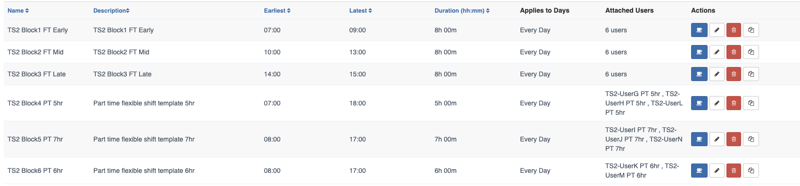

# Shift Template Rotation with constraints

In this scenario, shifts need to be generated based on the forecast requirements using below policy.

- Generate roster for 1 weeks period (March 23th - March 29th 2020)
- Fill users to contracted hours
- Rotate shifts fairly across rotation period
- Rotate user forward through **Shift Template** based on requirements
- Rotation Period is 1 week
- Fix shift start time within rotation period
- Use forecast requirement to determine start time
- Number of historical shifts that need to be used for fairness is 7 week.
- No historical shifts are provided (for the first roster generation. Output of the historical shifts
must be used as input when generating the next week roster (March 30th - April 5th 2020).

Based on the forecast requirements and users attached on this scenario, 
the algorithm can produce a roster that has 100% coverage. If the algorithm can generate 100% coverage for this 
roster period, you will need to generate the next 4 weekly rosters. Our weekly rosters are generated from Monday - Sunday (based on ISO Week).

- Second roster (March 30th - April 5th 2020)
  - The output for the (March 23th - March 29th 2020) roster will be used 
    as input historical shifts for each users (so that algorithm can use these historical shifts 
    for template rotation, fairness on "start time and day of week allocation")
- Third roster (April 6th - April 12th 2020)
  - The output for the first roster (March 23th - March 29th 2020) and second roster (March 30th - April 5th 2020) 
  will be used as input historical shifts 
- Fourth roster (April 13th - April 19th 2020)
  - The output of the above 3 rosters need to be used as input historical shifts.

(**NOTE**: The roster generation algorithm should generate shift fairly for users based on the requirements.)

  
# One Week Coverage

## Monday, Tuesday, Wednesday & Friday Coverage

## Thursday Coverage

## Weekend Coverage

In this test scenario, the weekend requirement is to have 1 FTE between 8am-12pm and 2 FTE between 12pm-7pm.
Multiple shift patterns can be generated to fill up the forecast requirements. 
Above screen shot is one of the examples to fill the requirement for the weekend.

# User Availabilities & Contract

# Shift Template

## "TS2 Block1 FT Early" shift template
Template configuration 

- start anytime between 07:00 - 09:00 (based on the timezone of the user)
- shift duration 8 hours
- applied to "Monday - Sunday"
- attached users 
    - ("TS2-UserA", "TS2-UserB", "TS2-UserC", "TS2-UserD", "TS2-UserE", "TS2-UserF")
- constraints (2 users need to be allocated on this template)
    - minStaff: 2
    - maxStaff: 2

## "TS2 Block2 FT Mid" shift template
Template configuration 

- start anytime between 10:00 - 13:00 (based on the timezone of the user)
- shift duration 8 hours
- applied to "Monday - Sunday"
- attached users 
    - ("TS2-UserA", "TS2-UserB", "TS2-UserC", "TS2-UserD", "TS2-UserE", "TS2-UserF")
- constraints (No constrains for this template)

## "TS2 Block3 FT Late" shift template
Template configuration 

- start anytime between 14:00 - 15:00 (based on the timezone of the user)
- shift duration 8 hours
- applied to "Monday - Sunday"
- attached users 
    - ("TS2-UserA", "TS2-UserB", "TS2-UserC", "TS2-UserD", "TS2-UserE", "TS2-UserF")
- constraints (2 users need to be allocated on this template)
    - minStaff: 2
    - maxStaff: 2

## "TS2 Block4 PT 5hr" shift template
Template configuration 

- start anytime between 07:00 - 18:00 (based on the timezone of the user)
- shift duration 5 hours
- applied to "Monday - Sunday"
- attached users 
    - ("TS2-UserG", "TS2-UserH" & "TS2-UserL")
- constraints (No constrains for this template)

## "TS2 Block5 PT 7hr" shift template
Template configuration 

- start anytime between 08:00 - 17:00 (based on the timezone of the user)
- shift duration 7 hours
- applied to "Monday - Sunday"
- attached users 
    - ("TS2-UserI", "TS2-UserJ" & "TS2-UserN")
- constraints (No constrains for this template)

## "TS2 Block6 PT 6hr" shift template
Template configuration 

- start anytime between 08:00 - 17:00 (based on the timezone of the user)
- shift duration 6 hours
- applied to "Monday - Sunday"
- attached users 
    - ("TS2-UserK" & "TS2-UserM")
- constraints (No constrains for this template)

### Generated Shifts
Below are the sample shifts that are generated (with 100% coverage) based on the forecast requirement for a weeks. 

## Template Rotation Tips

If 3 templates are shared by 6 users and 2 users needs to be allocated to each template based on the requirements,
it's straight forward to rotate the shift template every week for these 6 users 
(assuming that all 6 users are available to work on these templates). So a user will be allocated to early shift first week,
mid shift on second week and late shift on the third week. Below is the rotation pattern if all 6 users are allocated to all 3 templates
and available to work any time. 

- On Week 1
    - "Template 1 Early Shift" will be allocated to (User A & User B) 
    - "Template 2 Mid Shift"   will be allocated to (User C & User D)
    - "Template 3 Late Shift"  will be allocated to (User E & User F)
- On Week 2
    - "Template 1 Early Shift" will be allocated to (User E & User F)
    - "Template 2 Mid Shift"   will be allocated to (User A & User B)
    - "Template 3 Late Shift"  will be allocated to (User C & User D)
- On Week 3
    - "Template 1 Early Shift" will be allocated to (User C & User D) 
    - "Template 2 Mid Shift"   will be allocated to (User E & User F)
    - "Template 3 Late Shift"  will be allocated to (User A & User B)

In this test scenario, "User C" and "User D" are assigned to 3 shift templates 
("TS2 Block1 FT Early", "TS2 Block2 FT Mid" & "TS2 Block3 FT Late"). 
Due to the user availabilities constraints on "User C" and "User D", 
**"User C" is only available to work on early template**
and **"User D" is only available to work on the late template**.

The roster generation algorithm must identify these constraints and rotate the rest of the 4 flexible users 
**(User A, User B, User E & UserF)** across 3 templates based on the forecast requirements. 
As the fixed number of staffs constraint is configured at ("TS2 Block1 FT Early" & "TS2 Block3 FT Late") templates 
and constraints on some users with fixed available time (i.e "User C" can only be allocated to early template 
& "User D" is only available to work on late template), the system can only allocate one more user to early shift template and one more user to late
template. And the rest of the users will be allocated to mid template.

Therefore the rest of the 4 users who got allocated to these three templates (Early, Mid & Late) should be rotated 
in the below pattern based on the forecast requirements for each user. 
User A will be allocated to

- "Early Shift" on week 1
- "Mid Shift" on week 2
- "Mid Shift" on week 2
- "Late Shift" on week 3

The algorithm must identify the rotation pattern based on the 

- forecast requirements, 
- users with fixed available time,
- no of available templates in the rotation period
- constraints of the shift templates 

