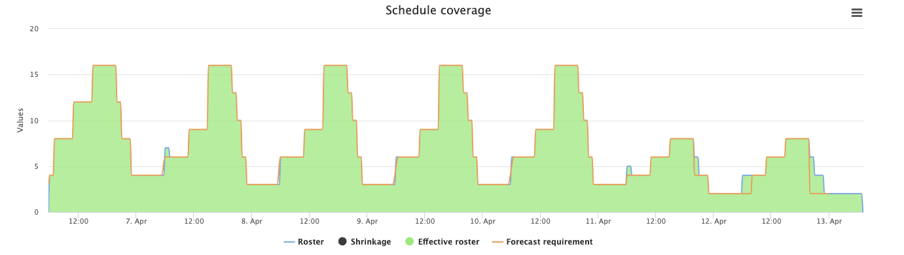
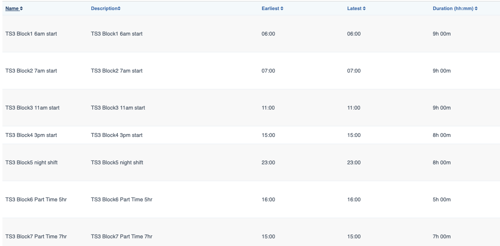

# Workload rotations 24 x 7 coverage single timezone

In this scenario, shifts need to be generated based on the forecast requirements using below policy.

- Generate roster for 1 weeks period (April 6th - April 12th 2020)
- Fill users to contracted hours
- Rotate shifts fairly across rotation period
- Rotate user forward through **Shift Template** based on requirements
- Rotation Period is 1 week
- Fix shift start time within rotation period
- Use forecast requirement to determine start time
- Number of historical shifts that need to be used for fairness is 7 week.
- No historical shifts are provided (for the first roster generation. Output of the historical shifts)
- Since this scenario is 24 x 7 coverage, need to consider about coverage from sunday overnight shift from previous roster

# One Week Coverage

# User Availabilities & Contract
All users are available 24 x 7 in this scenario.

- (TS3-User101 - TS3-User124) contract is to have 5 shifts & 40 paid hours per week 
- (TS3-User201 - TS3-User204) contract is to have 5 shifts & 20 paid hours per week
- (TS3-User301 - TS3-User304) contract is to have 4 shifts & 28 paid hours per week

# Shift Template

(TS3 Block 1, TS3 Block 2, TS3 Block 3, TS3 Block 4 & TS3 Block 5 ) templates are assigned to users(TS3-User101 - TS3-User124). 
So these users need to be rotated fairly across these templates.

(TS3-User201 - TS3-User204) users are assigned to "TS3 Block6 Part Time 5hr" templates.

(TS3-User301 - TS3-User304) users are assigned to "TS3 Block7 Part Time 7hr" templates.